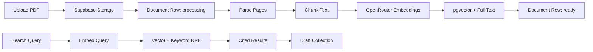

# Document Search Implementation Plan

## Goal
Turn the current skeleton into a defensible 3-hour prototype: upload PDFs, parse and index them, search with citations, and collect passages into a draft panel. The current app already has the workspace layout, typed API route stubs, Supabase schema, and candidate notes; the plan is to fill the retrieval path rather than redesign the shell.

## Current Starting Point
- Keep the existing UI shell in [`src/components/workspace/WorkspacePage.tsx`](src/components/workspace/WorkspacePage.tsx), [`src/components/upload/DocumentDropzone.tsx`](src/components/upload/DocumentDropzone.tsx), [`src/components/library/DocumentLibrary.tsx`](src/components/library/DocumentLibrary.tsx), [`src/components/search/SearchResults.tsx`](src/components/search/SearchResults.tsx), and [`src/components/draft/DraftPanel.tsx`](src/components/draft/DraftPanel.tsx).
- Replace the placeholder responses in [`src/app/api/documents/upload/route.ts`](src/app/api/documents/upload/route.ts), [`src/app/api/documents/route.ts`](src/app/api/documents/route.ts), [`src/app/api/search/route.ts`](src/app/api/search/route.ts), and [`src/app/api/drafts/route.ts`](src/app/api/drafts/route.ts).
- Extend [`supabase/migrations/001_initial.sql`](supabase/migrations/001_initial.sql) only where needed for vector search indexes, status/progress fields, and SQL helper functions.

## Proposed Flow

## Implementation Plan
1. Quickly verify the relevant Next.js 16 App Router/API route guidance in `node_modules/next/dist/docs/` before editing route handlers, per the workspace rule. Phase 1 itself is already complete.
2. Wireframe the majority of the product flows before backend work: empty upload, uploading/processing, ready library, search, no-results, cited results, add-to-draft, draft review, and failed ingestion. Keep these low-fi and implementation-facing, either as a small markdown flow map or quick in-app layout notes, not a polished Figma exercise.
3. Add small server modules under `src/lib/` for the RAG pipeline: PDF parsing, text chunking, OpenRouter embedding, Supabase document/chunk persistence, and hybrid search. Keep the modules explicit and commented so they can be explained in the interview.
4. Wire upload in [`src/app/api/documents/upload/route.ts`](src/app/api/documents/upload/route.ts): validate PDFs, create a `documents` row with `processing`, upload the file to the private `pdfs` bucket, run parse -> chunk -> embed -> index, then mark `ready` or `failed`. For the prototype this can run inline after the upload request; the UI still presents it as async via status polling, and the write-up can call out Cloud Tasks/Pub/Sub as the production queue.
5. Wire document listing in [`src/app/api/documents/route.ts`](src/app/api/documents/route.ts): return persisted documents ordered by newest first, including status, size, created time, page count, and any error state needed by the UI.
6. Add hybrid search: embed the query through OpenRouter, query pgvector and Postgres full-text, combine rankings with reciprocal rank fusion, and return top cited snippets with filename, page, score, and lightweight highlighting.
7. Upgrade the UI states according to the wireframes without changing the product shape: show upload progress/status in the library, poll documents while any are `processing`, disable or explain search when no documents are ready, display empty/no-results/error states, and keep `Add to draft` obvious on result cards.
8. Persist draft collection if time allows after retrieval is working: use the existing `drafts` and `draft_items` tables, while keeping the current browser-state fallback acceptable for the demo if retrieval takes priority.
9. Update [`CANDIDATE_NOTES.md`](CANDIDATE_NOTES.md) with what was built, conscious cuts, and the production path: OCR, table extraction, real queue infra, tenant isolation/RLS, reranking, and retrieval evaluation.
10. Verify with `npm run lint`, `npm run typecheck`, and a manual happy path: start local Supabase/dev server, upload a text PDF, wait for `ready`, search a known phrase and a semantic query, add a result to the draft.

## Scope Guardrails
- Build retrieval first; draft generation is a stretch only after upload/search are working.
- Do not build OCR, scanned-PDF support, table extraction, reranking, or real background queue infrastructure.
- Keep all model calls behind `OPENROUTER_API_KEY` and `OPENROUTER_BASE_URL`; do not commit secrets.
- Prefer clear route and library code over abstraction-heavy service layers, because the demo needs to be readable and defensible.
