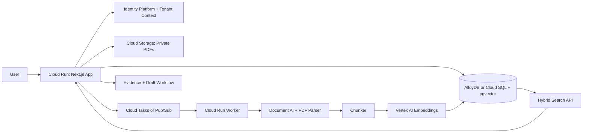

# Production Plan

This prototype proves the core loop: upload PDFs, extract text, index passages, search with citations, and collect evidence for proposal work. To take it to production on GCP, the main change is to separate long-running ingestion from the web request path, add tenant-aware security, and put quality/cost controls around retrieval.

## Target Architecture

## Production Flow

1. The app accepts the PDF upload, validates file type and size, stores the PDF in private object storage, creates a `documents` row with `processing`, and enqueues an ingestion job.
2. A worker pulls the job, extracts text page-by-page, falls back to OCR when needed, chunks text with page metadata, embeds chunks in batches, and writes them to the vector/keyword index.
3. The worker updates document status to `ready` or `failed`. The UI polls or subscribes to status changes and only enables search once at least one document is ready.
4. Search embeds the query, runs vector search and keyword search, merges candidates with reciprocal rank fusion, and returns cited snippets with document and page provenance.
5. Users save useful passages into an evidence collection or draft workflow, preserving source citations.

## GCP Infrastructure

- **Web app:** Cloud Run runs the Next.js app behind HTTPS Load Balancing.
- **Auth:** Identity Platform provides user auth; every request resolves to a tenant and user context.
- **Queue:** Cloud Tasks is a simple fit for per-document ingestion jobs with retries and rate limits. Pub/Sub is an alternative if the pipeline becomes more event-driven.
- **Workers:** Cloud Run jobs or services handle parse, OCR, chunk, embed, and index work outside the request path.
- **Storage:** Cloud Storage stores private PDFs using tenant-scoped object paths and short-lived signed access where needed.
- **Database:** AlloyDB or Cloud SQL for PostgreSQL with pgvector stores documents, chunks, draft evidence, and vector indexes.
- **OCR and extraction:** Document AI handles scanned PDFs and table-heavy documents where plain text extraction is not enough.
- **Model layer:** Vertex AI embeddings and reranking/generation models sit behind a small adapter so model choices remain replaceable.
- **Secrets:** Secret Manager stores database credentials, model configuration, and any provider keys.
- **Observability:** Cloud Logging, Cloud Monitoring, Error Reporting, and Trace cover upload/job/search paths, queue depth, ingestion failures, latency, and model spend.

## Scaling Challenges

- **Long-running ingestion:** Large PDFs and OCR can exceed request timeouts. Queue-backed workers make ingestion retryable and keep the UI responsive.
- **Embedding cost and latency:** Batch embeddings, deduplicate chunks by content hash, cache query embeddings where useful, and monitor cost per document.
- **Vector index growth:** pgvector is enough for a strong starting point, but millions of users may require partitioning by tenant, separate indexes, AlloyDB tuning, or a managed vector store.
- **Search quality:** Hybrid search is a good baseline, but production should add an evaluation set, recall@k tracking, query logs, and eventually reranking.
- **Scanned PDFs and tables:** OCR and table extraction need separate handling because plain PDF text extraction will miss scanned content and often damages tabular structure.
- **Data isolation:** Proposal/RFP data is sensitive. Tenant isolation, least-privilege service roles, encryption, audit logs, and deletion guarantees are required before production use.

## Multi-Tenancy And Security

Every document, chunk, draft, and evidence item should carry a `tenant_id` and, where needed, a `user_id`. Database queries should always be tenant-scoped, with Row Level Security enabled for user-facing access. Server-side workers can use service-role credentials, but job payloads must include tenant context and should validate ownership before reading or writing data.

PDFs should live in private buckets with tenant-scoped object keys. Access should be via short-lived signed URLs or server-side streaming only. Uploaded files should be scanned, size-limited, and deleted from storage when the parent document is deleted.

## Retrieval Quality Plan

Start with a small labelled evaluation set from realistic RFP/proposal documents:

- exact phrase queries;
- semantic queries where the answer uses different wording;
- compliance/deadline/risk queries;
- negative queries that should return no result;
- scanned or table-heavy PDFs as known hard cases.

Track recall@k, citation correctness, latency, and “useful result added to evidence” as a product signal. Once baseline quality is measured, compare chunk sizes, overlap, embedding models, keyword weighting, and reranking.

## Trade-Offs

- **Inline ingestion vs queue:** Inline ingestion is simpler for the prototype, but queues are required for reliability and large files.
- **Postgres pgvector vs dedicated vector DB:** pgvector on AlloyDB or Cloud SQL keeps the system simple and transactional early on. A dedicated vector service may become worthwhile if index size, latency, or operational tuning becomes a bottleneck.
- **Hybrid search vs vector-only:** Hybrid search is slightly more complex, but it handles exact terms, acronyms, compliance clauses, and semantic queries better than either retrieval mode alone.
- **OCR now vs later:** OCR is essential for scanned PDFs, but it adds cost, latency, and operational complexity. The prototype should fail clearly; production should process OCR asynchronously.
- **Grounded draft generation vs search-first:** Search and evidence collection build trust first. Draft generation should be grounded strictly in saved passages and keep citations visible.

## Near-Term Roadmap

1. Move ingestion into a queue-backed worker with retries, job status, and idempotency keys.
2. Add auth, tenant IDs, RLS policies, and tenant-scoped storage paths.
3. Add OCR fallback for scanned PDFs and clearer table extraction strategy.
4. Build a retrieval evaluation set and track recall@k, citation accuracy, and latency.
5. Add reranking behind a feature flag once baseline retrieval metrics exist.
6. Add evidence item deletion/reordering and grounded draft generation.
7. Add production observability: queue depth, ingestion failure rate, search latency, model spend, and per-tenant usage.

## Current Prototype Cuts

The current app intentionally keeps these out of scope: background queues, OCR, table extraction, auth, tenant isolation, RLS, reranking, retrieval evaluation, and production-grade observability. Those are the right next steps before offering the feature to real customers.
